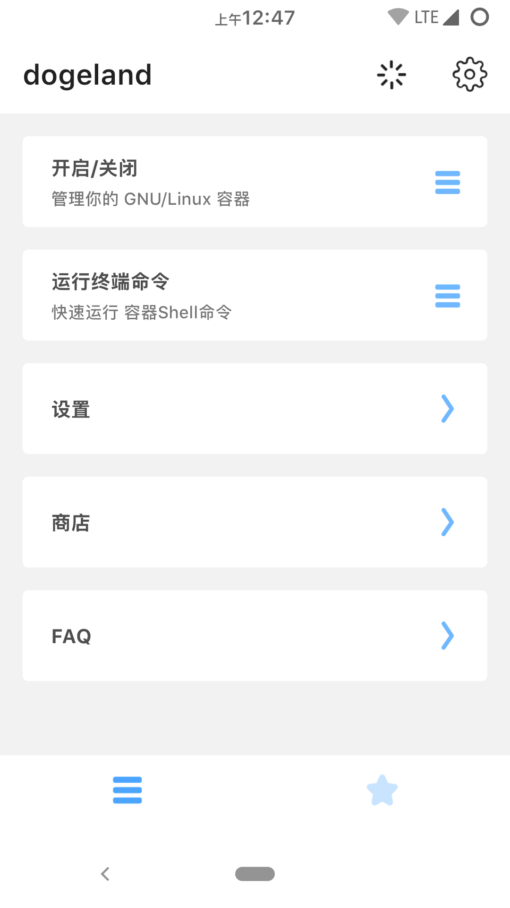
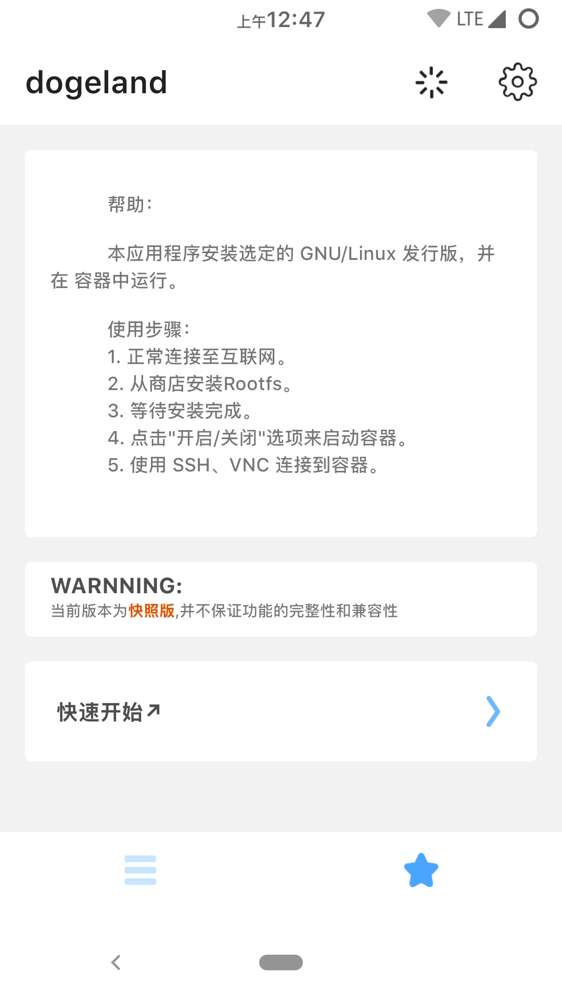
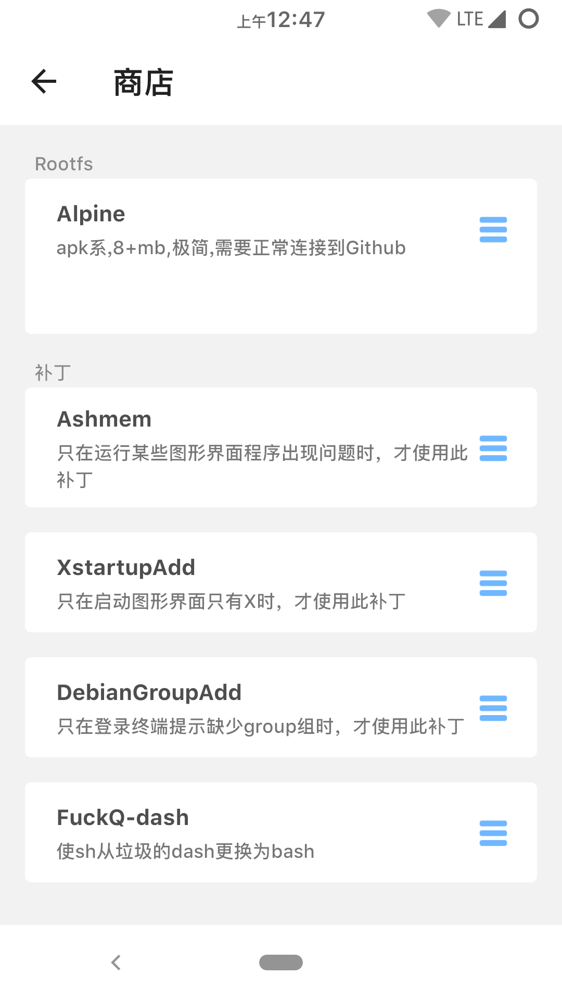
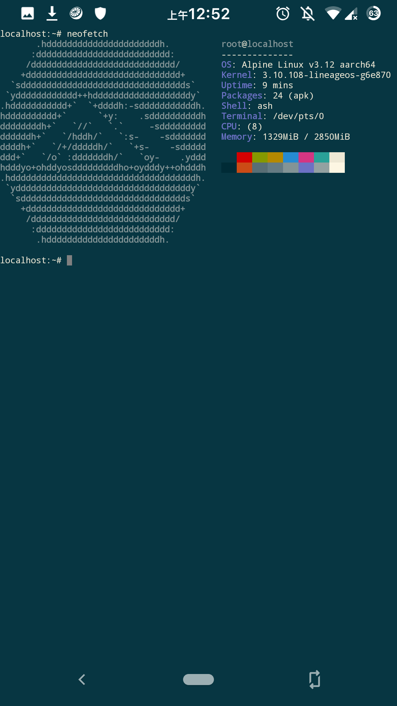

# dogeland
No need to ROOT to run any GNU/Linux distribution on Android.
 (Alpine is used for testing, the actual release is not only alpine)

## rely
  
busybox  
  
proot  
  
libandroid-shmem  
  
libtalloc  
  
termux-elf-cleaner  